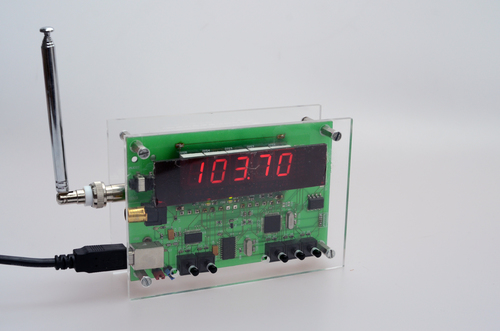

###PC-Radio

Analog TV and radio receiver USB device.

Based on a Philips FM1216 tuner which was often found on TV-cards.

The FM1216 contains all HF-components in a shielded package and can be controlled by I2C.

My device has a PIC16F877 as main MCU, FT232R as USB controller and a SAA6588 RDS decoder. 

It can be used alone or connected to a PC. In the latter case it can be controlled by a serial protol. You can then also read the encoded or decoded RDS datastream to display it on the PC. 

Accompanying software is my "Gizmo-Feeder" available in its own repository.

I have used the device for a long time for watching tv at my desk, but unfortunately all non-digital stations near my home were shut down a while ago, so it is useless to me now.

It also has an ICSP connector.

###Tools

PCB made with CadSoft Eagle

Microchip MPLAB 7

CCS-PICC C-Compiler

###License

[BSD](LICENSE-BSD.txt) for software

[Creative Commons 4.0](LICENSE-CC.txt) for pcb and other artwork

###Copyright

Copyright (c) 2006 Bjoern Seip

